# dotfiles-universal

A universal, cross-platform development environment configuration that works on both macOS and Linux (Pop!_OS/Ubuntu).

## Features

- 🖥️ **Cross-platform**: Works on macOS and Linux
- 🚀 **Fast setup**: Automated installation scripts
- 🎨 **Beautiful UI**: Dracula theme with Powerlevel10k
- ⚡ **Performance**: Optimized for speed and efficiency
- 🔧 **Modular**: Install only what you need

## Quick Start

### One-Command Installation
```bash
# Clone and install everything
git clone https://github.com/r3morce/dotfiles.git ~/.dotfiles && cd ~/.dotfiles && ./install.sh
```

### Manual Installation

1. **Clone the repository:**
   ```bash
   git clone https://github.com/r3morce/dotfiles.git ~/.dotfiles
   cd ~/.dotfiles
   ```

2. **Run the installer:**
   ```bash
   ./install.sh
   ```

   Or use the Makefile:
   ```bash
   # For macOS
   make setup-macos && make install
   
   # For Linux
   make setup-linux && make install
   ```

## Repository Structure & Symlinks

The dotfiles are organized using GNU Stow, which creates symlinks from the repository directories to your home directory:

```mermaid
---
config:
  theme: 'dracula'
---
graph LR
    subgraph "Repository"
        A[📁 dotfiles/]
        B[📁 zsh/]
        C[📁 nvim/]
        D[📁 wezterm/]
        E[📁 p10k/]
        F[📁 scripts/]
        G[📄 README.md]
        H[📄 Makefile]
    end
    
    subgraph "Config Files"
        B1[📄 .zshrc]
        C1[📁 .config/nvim/]
        D1[📁 .config/wezterm/]
        E1[📄 .p10k.zsh]
    end
    
    subgraph "Home Directory"
        I[📄 ~/.zshrc]
        J[📁 ~/.config/nvim/]
        K[📁 ~/.config/wezterm/]
        L[📄 ~/.p10k.zsh]
        M[❌ Not symlinked]
    end
    
    A --> B
    A --> C
    A --> D
    A --> E
    A --> F
    A --> G
    A --> H
    
    B --> B1
    C --> C1
    D --> D1
    E --> E1
    
    B1 -.->|symlink| I
    C1 -.->|symlink| J
    D1 -.->|symlink| K
    E1 -.->|symlink| L
    
    F -.->|ignored| M
    G -.->|ignored| M
    H -.->|ignored| M

    classDef greenBorder stroke:#14710A,stroke-width:2px
    class I,J,K,L,B1,C1,D1,E1 greenBorder


```


